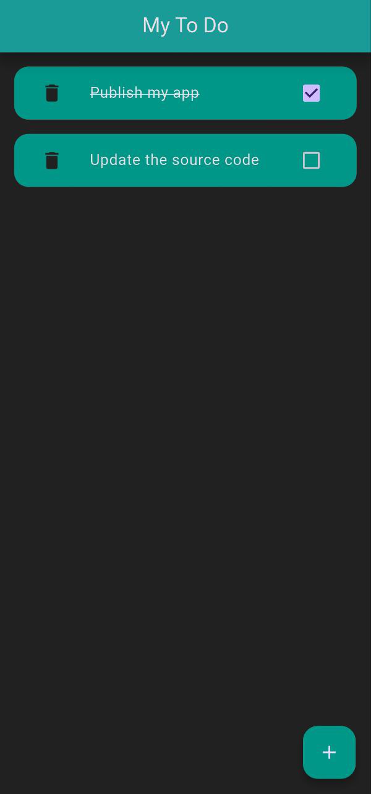

# To-Do List App

A simple and elegant Flutter to-do list app with local storage. This app allows users to add, complete, and delete tasks, with all data persisted locally using `shared_preferences`.

## Table of Contents
- [Features](#features)
- [Screenshots](#screenshots)
- [Installation](#installation)
- [Usage](#usage)
- [Dependencies](#dependencies)
- [License](#license)

## Features
- **Add Tasks**: Easily add new tasks with a simple form.
- **Complete Tasks**: Mark tasks as completed with a checkbox.
- **Delete Tasks**: Remove tasks you no longer need.
- **Local Storage**: Tasks are saved locally using `shared_preferences`, so they persist even after the app is closed.
- **Dark Theme**: A sleek dark theme with teal accents for a modern look.

## Screenshots
  
*Add tasks and manage your to-do list.*

## Installation
Follow these steps to run the app locally:

1. **Clone the repository**:
   ```bash
   git clone https://github.com/zaki-mj/MyToDo.git
   ```
2. **Navigate to the project directory**:
   ```bash
   cd MyToDo
   ```
3. **Install dependencies**:
   ```bash
   flutter pub get
   ```
4. **Run the app**:
   ```bash
   flutter run
   ```

## Usage
- **Add a Task**: Tap the `+` button to open the add task dialog. Enter the task name and press "Add".
- **Complete a Task**: Tap the checkbox next to a task to mark it as completed.
- **Delete a Task**: Swipe left on a task or tap the delete icon to remove it.

## Dependencies
This app uses the following packages:
- [`shared_preferences`](https://pub.dev/packages/shared_preferences): For local storage.
- [`flutter`](https://flutter.dev/): The framework used to build the app.

## License
This project was made for the purpose of learning Flutter and is free to use by anyone.

---

Made with ❤️ by **Zaki MJ**