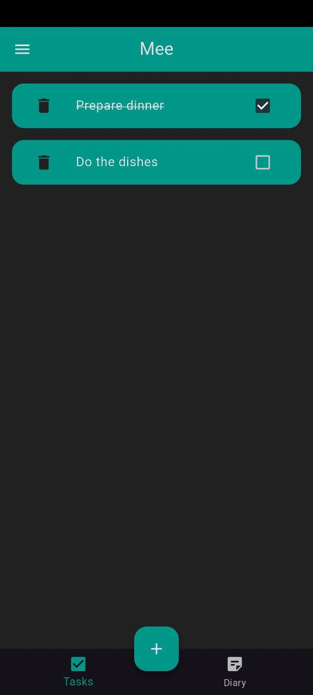
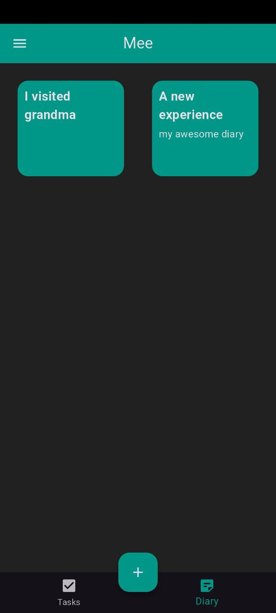
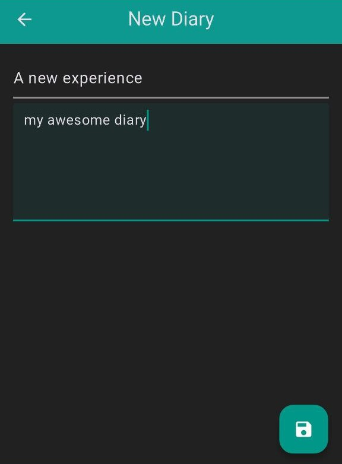
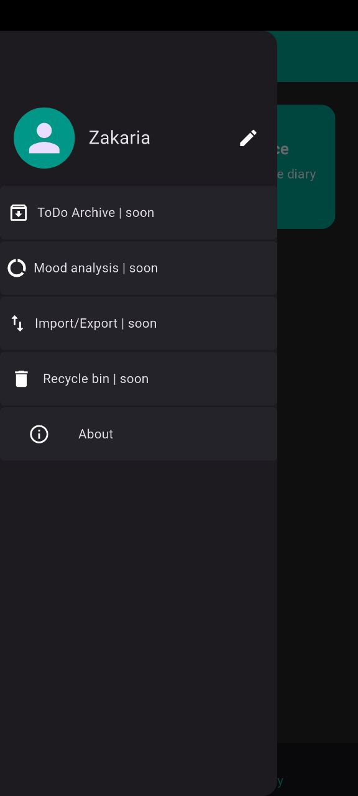

# MyToDo

A simple and elegant Flutter to-do list personal diary app. Enjoy a sleek and elegant Flutter application that not only manages your daily tasks but also helps you keep a journal of your thoughts. Stay organized with local storage , with all data persisted locally using `shared_preferences`. and get ready for even more features coming soon.

## Table of Contents
- [Features](#features)
- [Screenshots](#screenshots)
- [Installation](#installation)
- [Usage](#usage)
- [Dependencies](#dependencies)
- [Upcoming Features](#upcoming-features)
- [Releases](#releases)
- [License](#license)

## Features
- **Username Customisation**: Personalize your experience by setting your own username.
- **To-Do List Functionalities**:
  - **Add Tasks**: Easily add new tasks with a simple form.
  - **Edit Tasks**: Modify existing tasks without having to delete them.
  - **Remove Tasks**: Delete tasks you no longer need.
  - **Complete Tasks**: Mark tasks as completed using a checkbox.
- **Diary Functionalities**:
  - **Add Diary Entries**: Write and save your daily diary entries.
  - **Edit Diary Entries**: Update your diary content whenever you want.
  - **Remove Diary Entries**: Delete entries that are no longer relevant.
  - **Export Diary Entries**: Export each diary entry as a separate `.txt` file to your Documents folder (`/Documents/Mee`) with the title as the filename.
- **Local Storage**: All your tasks and diary entries are saved locally using `shared_preferences`, ensuring your data persists even after closing the app.


## Screenshots

<p><em>Add tasks and manage your to-do list.</em></p>


<p><em>View and manage your diaries.</em></p>


<p><em>Easily edit your diaries.</em></p>


<p><em>Features coming soon.</em></p>

## Installation
Follow these steps to run the app locally:

1. **Clone the repository**:
   ```bash
   git clone https://github.com/zaki-mj/MyToDo.git
   ```
2. **Navigate to the project directory**:
   ```bash
   cd MyToDo
   ```
3. **Install dependencies**:
   ```bash
   flutter pub get
   ```
4. **Run the app**:
   ```bash
   flutter run
   ```

## Usage
### Setting Up Your Username
- When launching the app for the first time, you will be prompted to set a username.  
- You can later edit your username from the drawer menu.

### Navigating Between Views
- Use the bottom navigation bar to switch between the **Task view** and the **Diary view**.

### Adding Tasks and Diary Entries
- Tap the floating `+` button while on the desired page to add either a **task** or a **diary entry**.

### Managing Tasks
- **Edit a Task**: Long press on a task to modify its content.
- **Complete a Task**: Tap the checkbox next to a task to mark it as completed.
- **Remove a Task**: tap on the delete icon to remove a task.

### Managing Diary Entries
- **Edit a Diary Entry**: Tap on a diary entry to modify its content.
- **Remove a Diary Entry**: Long press on an entry to remove it.
- **Export Diary Entries**: From the drawer or diary screen (depending on your app design), tap the **"Export all diaries"** button to save all entries as `.txt` files in your phone's storage (`/Documents/Mee`). Each file is named using the diary title.


### Accessing the About Page
- Open the **drawer menu** and tap **"About"** to learn more about the app.

## Dependencies
This app uses the following packages:
- [`shared_preferences`](https://pub.dev/packages/shared_preferences): For local storage.

## Releases
Check out the latest releases and download the APK:
[GitHub Releases](https://github.com/zaki-mj/MyToDo/releases)

## Upcoming Features

I am actively working on exciting new features to enhance your experience:

- **To-Do Archive**: Store completed tasks in an archive for future reference.  
- **Mood Analysis**: Analyze your diary entries to track mood patterns over time.  
- **Export to PDF**: Save and share your tasks and diary entries as PDF files.  
- **Recycle Bin**: Restore accidentally deleted tasks or diary entries before they are permanently removed.  


## License
This project was made for the purpose of learning Flutter and is free to use by anyone.
**Note:** We will be rebranding to "Mee" soon, replacing the current name "MyToDo".

---

Made with ❤️ by **Zakaria**